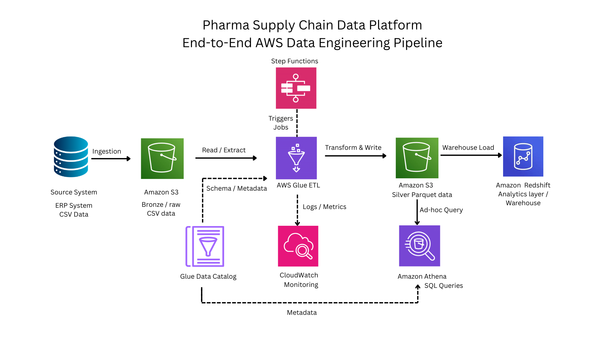

# Pharma Supply Chain Data Platform

**Batch Data Pipeline on AWS — 4.7M supply chain records across 11 tables (2022–2025)**  
Schema-enforced transformation from raw ERP CSVs to analytics-ready, partitioned Parquet.

> Raw ERP exports → typed, validated, partitioned Parquet for analytics

---

This diagram shows the end-to-end batch data pipeline on AWS, where raw ERP CSV exports are ingested into S3, transformed using AWS Glue with strict data quality enforcement, and stored as partitioned Parquet datasets for analytics via Amazon Athena and Redshift.

---

## What This Pipeline Does

Pharmaceutical ERP systems export orders, inventory movements, batch allocations, and product data as raw CSVs — independently, with no schema enforcement. This platform ingests four years of that data, enforces a strict quality contract during transformation, and loads it into a queryable warehouse layer.

The engineering focus is on **correctness and reliability** — schema enforcement, fail-fast quality gates, forensic error reporting, and dependency-aware job execution.

---

## Engineering Highlights

- **Fail-fast quality gates**
  - PK violations, schema mismatches, and date parse failures abort execution
  - Forensic reject sets written to S3 before any output is committed

- **Explicit schema enforcement**
  - All 11 tables defined using PySpark `StructType`
  - No reliance on crawler-based inference

- **Job isolation**
  - Orders (~3.6M rows) processed in a separate job
  - Prevents high-volume failures from blocking other datasets

- **Dependency-aware execution**
  - Dimensions processed before dependent facts
  - Avoids partial warehouse states

- **Concurrent run guard**
  - S3 run markers prevent overlapping writes

- **Partition-aware writes**
  - Only affected partitions are overwritten during re-runs

---

## Data Scale

| | |
|---|---|
| Total records | ~4.7M across 11 tables |
| Orders | 3.6M rows · partitioned by year / month |
| Inventory movements | ~1M rows · partitioned by year |
| Time range | 2022–2025 (4 years) |
| Plants | 57 distribution nodes |
| Customers | 2,500+ retail / distributor accounts |
| Products | 702 SKUs across therapeutic segments |

---

## Pipeline Stages

### Phase 1 — Data Profiling
Analyzed all source tables using PySpark — nulls, duplicates, grain validation, key structure, and schema inconsistencies. Findings drove every downstream design decision.

### Phase 2 — Raw Ingestion
CSV data loaded into S3 without transformation. Fact tables partitioned by year (and month for orders) at ingestion time to scope downstream processing.

### Phase 3 — Schema & Catalog Contract
Explicit target schemas defined for all 11 tables based on profiling. Glue Catalog used for metadata and partition discovery — not as schema authority.

### Phase 4 — ETL Transformation (Silver Layer)
Two Glue PySpark jobs transform raw CSV into typed, validated Parquet:

- **`etl_orders.py`** — orders fact table; single-pass PK aggregation; enum normalization; forensic reject output
- **`etl_multi_table.py`** — 7 dimensions then 3 facts; atomic commit protocol; concurrent run guard

### Phase 5 — Orchestration
AWS Step Functions coordinates the two Glue jobs with retry logic and failure notification. Implemented to demonstrate dependency management and failure handling — the same pattern supports incremental pipelines in production.

### Phase 6 — Warehouse Load
Curated Parquet datasets will be loaded into Amazon Redshift to support analytical workloads.

---

## Data Model

Star schema · event-level granularity · no pre-aggregated tables

| Layer | Tables |
|---|---|
| Dimensions | customers · plant\_warehouse · products\_master · manufacturers · products\_annual\_demand |
| Bridge | customer\_plant\_mapping · product\_manufacturer\_bridge |
| Facts | orders\_erp · inventory\_movements · batch\_allocator\_central · product\_batches |

**Key modeling decision — orders grain**

`orders_erp` is stored at ERP export event level, not order line level. `ORDER_LINE_ID` repeats across lifecycle states (ordered → delivered → invoiced → returned). The physical PK is `ERP_EXPORT_ROW_ID`.

This preserves the full order lifecycle and enables return pattern and fulfillment timeline analysis. Aggregating quantities requires filtering by `line_status` — documented in the schema contract.

---

## Tech Stack

| | |
|---|---|
| Storage | Amazon S3 |
| Compute | AWS Glue (PySpark) |
| Orchestration | AWS Step Functions |
| Metadata | AWS Glue Data Catalog |
| Warehouse | Amazon Redshift (target layer) |
| Query | Amazon Athena |
| Format | Parquet · Snappy compression |
| Language | Python 3.10 |

---

## Data & Security Notes

- No real pharmaceutical data is included in this repository
- Source datasets in private S3 buckets
- Configuration files are templates only (no credentials or sensitive information)